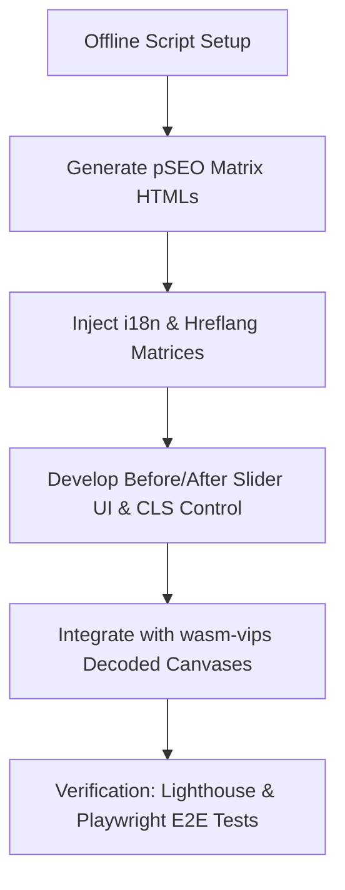

# PicEte Programmatic SEO & Organic Growth Technical Spec (Executable)

This specification outlines the technical roadmap for implementing the PicEte SEO and Organic Growth Plan, fully aligning with the audited PRD and confirmed design conclusions.

---

## 1. Core Architecture Decisions

### 1.1 Flat URL Routing (No `/tools/` Prefix)
* **Rule**: All tools will be served from the root of their respective locale directories.
* **Paths**:
  - English: `https://picete.com/[tool-name]/` (e.g., `https://picete.com/raw-to-jpg/`)
  - Locales: `https://picete.com/[lang]/[tool-name]/` (e.g., `https://picete.com/zh/raw-to-jpg/`)
* **Tool Name Alignment**:
  - Use `/instagram-image-splitter/` instead of `/instagram-grid-splitter/`.
  - Use `/resize-image-for-facebook-cover/` instead of `/facebook-cover-resizer/`.

### 1.2 Pure Static Architecture & Offline Generation
* **Rule**: Keep host static (Vercel CDNs) with zero runtime execution. No SSR/Edge Functions.
* **Pipeline**: Develop an offline python script `scripts/build/pSEO_matrix_generator.py`.
  - Reads templates (`templates/tool_base.html` or existing tools as base).
  - Merges seed data, modifiers, i18n text, and custom content blocks (Specs, FAQ, TDK, Schema JSON-LD).
  - Generates final static `index.html` files for all 9 languages in their respective directories.

### 1.3 Complete Hreflang Matrix
* **Rule**: Every tool page must contain exactly 10 alternate link tags in `<head>` (9 languages + `x-default` pointing to English version).
* **Locale codes**: `en`, `zh`, `ja`, `de`, `fr`, `es`, `pt`, `ar`, `ko`.
* **Example**:
  ```html
  <link rel="alternate" hreflang="en" href="https://picete.com/raw-to-jpg/" />
  <link rel="alternate" hreflang="zh" href="https://picete.com/zh/raw-to-jpg/" />
  <link rel="alternate" hreflang="ja" href="https://picete.com/ja/raw-to-jpg/" />
  <link rel="alternate" hreflang="de" href="https://picete.com/de/raw-to-jpg/" />
  <link rel="alternate" hreflang="fr" href="https://picete.com/fr/raw-to-jpg/" />
  <link rel="alternate" hreflang="es" href="https://picete.com/es/raw-to-jpg/" />
  <link rel="alternate" hreflang="pt" href="https://picete.com/pt/raw-to-jpg/" />
  <link rel="alternate" hreflang="ar" href="https://picete.com/ar/raw-to-jpg/" />
  <link rel="alternate" hreflang="ko" href="https://picete.com/ko/raw-to-jpg/" />
  <link rel="alternate" hreflang="x-default" href="https://picete.com/raw-to-jpg/" />
  ```

---

## 2. Config Specifications (`config/pSEO-matrix.json`)

To enable programmatic generation, the generator will load configurations from `config/pSEO-matrix.json`. The JSON file schema must follow this structure:

```json
{
  "tools": [
    {
      "id": "raw-to-jpg",
      "slug": "raw-to-jpg",
      "type": "converter",
      "icon": "📷",
      "features": {
        "en": "100% Client-side image processing, Privacy secured, Batch converting",
        "zh": "100% 浏览器本地处理，保障隐私安全，支持批量转换"
      },
      "tdk": {
        "en": {
          "title": "RAW to JPG - Free Online RAW to JPG Converter | PicEte",
          "description": "Convert camera RAW files (CR2, NEF, ARW, DNG) to high-quality JPG images in your browser. No upload, no signup, private and free.",
          "keywords": "RAW to JPG, RAW to JPG converter, CR2 to JPG, NEF to JPG, ARW to JPG, DNG to JPG"
        },
        "zh": {
          "title": "RAW 转 JPG - 免费在线 RAW 转换 JPG 工具 | PicEte",
          "description": "在浏览器中将相机 RAW 文件（CR2、NEF、ARW、DNG）转换为高质量 JPG 图像。无需上传，无需注册，隐私安全且完全免费。",
          "keywords": "RAW转JPG, RAW转换JPG, CR2转JPG, NEF转JPG, ARW转JPG, DNG转JPG"
        }
      },
      "specs": {
        "en": "<h3>How RAW to JPG Conversion Works</h3><p>RAW files contain unprocessed sensor data...</p>",
        "zh": "<h3>RAW 转 JPG 转换原理</h3><p>RAW 文件包含相机传感器未处理的原始数据...</p>"
      },
      "faq": {
        "en": [
          {
            "q": "What RAW formats are supported?",
            "a": "We support Canon CR2/CR3, Nikon NEF, Sony ARW, and Adobe DNG files."
          }
        ],
        "zh": [
          {
            "q": "支持哪些 RAW 格式？",
            "a": "我们官方支持佳能 CR2/CR3、尼康 NEF、索尼 ARW 和 Adobe DNG 文件。"
          }
        ]
      }
    }
  ]
}
```

---

## 3. Before/After Comparison Slider Component

### 3.1 Scope of Applicability
* **Supported Tools**: Single-image conversion & compression pages (e.g., `compress-image`, `raw-to-jpg`, `png-to-avif`, etc.).
* **Exempted Tools**: Multi-image outputs, splitters (`image-splitter`, `instagram-image-splitter`), base64 outputs, and color extractors.

### 3.2 HTML Structure & CLS Control (CLS < 0.05)
To prevent Cumulative Layout Shift (CLS), a wrapper with a pre-defined layout state is used:

```html
<div class="image-comparison-slider" id="comparisonSlider" style="display: none;">
  <!-- Fixed aspect ratio placeholder to prevent CLS -->
  <div class="slider-aspect-ratio-holder" style="aspect-ratio: 16 / 9; position: relative; overflow: hidden; width: 100%; max-width: 800px; margin: 0 auto; border-radius: 8px;">
    <!-- Skeleton loader display before images are loaded/rendered -->
    <div class="slider-skeleton" style="position: absolute; inset: 0; background: linear-gradient(90deg, var(--bg-secondary) 25%, var(--border-color) 50%, var(--bg-secondary) 75%); background-size: 200% 100%; animation: loading-shimmer 1.5s infinite;"></div>
    
    <!-- Image layers -->
    <div class="slider-container" style="position: absolute; inset: 0; width: 100%; height: 100%; opacity: 0; transition: opacity 0.3s ease;">
      <!-- Original Image (Left side background) -->
      
      
      <!-- Compressed Image (Right side overlay) -->
      <div class="img-compressed-wrapper" style="position: absolute; top: 0; right: 0; bottom: 0; left: 0; width: 50%; overflow: hidden; pointer-events: none; border-left: 2px solid var(--primary-color);">
        
      </div>
      
      <!-- Slider Handle -->
      <div class="slider-handle" style="position: absolute; top: 0; bottom: 0; left: 50%; width: 40px; margin-left: -20px; cursor: ew-resize; display: flex; align-items: center; justify-content: center; z-index: 10;">
        <div class="slider-handle-button" style="width: 40px; height: 40px; border-radius: 50%; background: var(--primary-color); border: 4px solid #fff; box-shadow: 0 2px 6px rgba(0,0,0,0.3); display: flex; align-items: center; justify-content: center; color: #fff; font-size: 18px; font-weight: bold; user-select: none;">
          ↔
        </div>
      </div>
    </div>
  </div>
  <div class="slider-info" style="margin-top: 0.5rem; font-size: 0.875rem; color: var(--text-light); text-align: center;">
    Original: <span class="size-orig">0 KB</span> | Converted: <span class="size-conv">0 KB</span> (<span class="size-diff">-0%</span>)
  </div>
</div>
```

### 3.3 JS Control Logic (`js/image-comparison-slider.js`)
* **Aspect Ratio sync**: Once the image loads, JS reads the native width and height of the image and adjusts `aspect-ratio` of `.slider-aspect-ratio-holder` dynamically to match the image ratio perfectly, keeping dimensions stable.
* **Original RAW image preview**: If the source file is RAW, the `wasm-vips` decoder will output a canvas. We render this canvas to a Blob URL using `canvas.toBlob(...)` and assign it to `.img-original`, enabling smooth hardware-accelerated preview rendering.
* **Drag interactions**: Listen to `mousedown`, `mousemove`, `mouseup` for mouse, and `touchstart`, `touchmove`, `touchend` for touch gestures on `.slider-handle`.
* **Dynamic widths**: Calculate pointer X offset relative to container boundary, update `.img-compressed-wrapper` width (e.g. `percentage + "%"`) and `.slider-handle` position (e.g. `left: percentage + "%"`).

---

## 4. Implementation Steps



### Phase 1: Offline Automation Generator
1. Write `scripts/build/pSEO_matrix_generator.py` to batch-inject:
   - JSON-LD schemas (`SoftwareApplication` with free offer + `BreadcrumbList` + `FAQPage`).
   - FAQ HTML markup and accordion script.
   - Hreflang headers (10-line block).
   - Technical Specs section.

### Phase 2: Before/After Slider Implementation
1. Create `js/image-comparison-slider.js` and update `css/style.css` to add:
   - Draggable vertical divider with drag handle.
   - Dual absolute layers for original/processed images.
   - Pre-rendered container with skeleton loaders to control layout shifts.

### Phase 3: Integration and Generation
1. Compile content specs and FAQ questions for all 48 tools in 9 languages.
2. Run generator script to deploy the files to `/zh/`, `/ja/`, etc.
3. Update `vercel.json` headers for any new tools.

### Phase 4: Quality & SEO Validation
1. Verify sitemap.xml updates (including locale subdirectories).
2. Audit CLS on Lighthouse/PageSpeed.
3. Perform E2E tests for the Before/After Slider.

---

## 5. Verification & Test Plan

### 5.1 Automated Script Checks
We will write `scripts/audit/verify_seo_matrix.py` to perform the following validations:
1. **Hreflang Checks**: Ensure every HTML file in the matrix contains exactly 10 alternate link tags, and all URLs return status `200` (or exist as physical files).
2. **Schema JSON-LD Checks**: Parse scripts containing `application/ld+json`. Ensure `@type: "SoftwareApplication"` has `offers`, and `FAQPage` contains the valid array of questions.
3. **Flat URL Rule**: Assert no directory exists inside `tools/` and no relative path utilizes `/tools/`.

### 5.2 Manual & UI Verification
1. Open page in browser, execute conversion, verify that the Before/After comparison slider renders cleanly.
2. Drag the slider to the left and right, checking responsiveness on touch/mouse inputs.
3. Run Chrome DevTools Performance panel, measure CLS during layout load. Assert CLS < 0.05.
