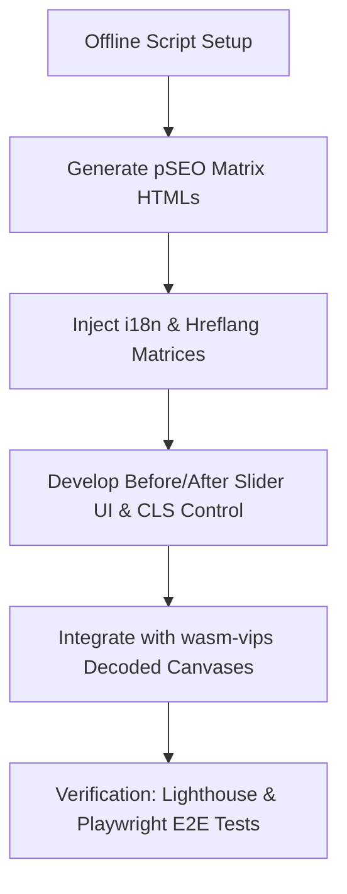

# PicEte Programmatic SEO & Organic Growth Technical Spec

This specification outlines the technical roadmap for implementing the PicEte SEO and Organic Growth Plan, fully aligning with the audited PRD and confirmed design conclusions.

---

## 1. Core Architecture Decisions

### 1.1 Flat URL Routing (No `/tools/` Prefix)
* **Rule**: All tools will be served from the root of their respective locale directories.
* **Paths**:
  - English: `https://picete.com/[tool-name]/` (e.g., `https://picete.com/raw-to-jpg/`)
  - Locales: `https://picete.com/[lang]/[tool-name]/` (e.g., `https://picete.com/zh/raw-to-jpg/`)
* **Tool Name Alignment**:
  - Use `/instagram-image-splitter/` instead of `/instagram-grid-splitter/`.
  - Use `/resize-image-for-facebook-cover/` instead of `/facebook-cover-resizer/`.

### 1.2 Pure Static Architecture & Offline Generation
* **Rule**: Keep host static (Vercel CDNs) with zero runtime execution. No SSR/Edge Functions.
* **Pipeline**: Develop an offline python/Node script `scripts/build/pSEO_matrix_generator.py`.
  - Reads templates (`templates/tool_base.html` or existing tools as base).
  - Merges seed data, modifiers, i18n text, and custom content blocks (Specs, FAQ, TDK, Schema JSON-LD).
  - Generates final static `index.html` files for all 9 languages in their respective directories.

### 1.3 Complete Hreflang Matrix
* **Rule**: Every tool page must contain exactly 10 alternate link tags in `<head>` (9 languages + `x-default` pointing to English version).
* **Locale codes**: `en`, `zh`, `ja`, `de`, `fr`, `es`, `pt`, `ar`, `ko`.
* **Example**:
  ```html
  <link rel="alternate" hreflang="en" href="https://picete.com/raw-to-jpg/" />
  <link rel="alternate" hreflang="zh" href="https://picete.com/zh/raw-to-jpg/" />
  <link rel="alternate" hreflang="ja" href="https://picete.com/ja/raw-to-jpg/" />
  <link rel="alternate" hreflang="de" href="https://picete.com/de/raw-to-jpg/" />
  <link rel="alternate" hreflang="fr" href="https://picete.com/fr/raw-to-jpg/" />
  <link rel="alternate" hreflang="es" href="https://picete.com/es/raw-to-jpg/" />
  <link rel="alternate" hreflang="pt" href="https://picete.com/pt/raw-to-jpg/" />
  <link rel="alternate" hreflang="ar" href="https://picete.com/ar/raw-to-jpg/" />
  <link rel="alternate" hreflang="ko" href="https://picete.com/ko/raw-to-jpg/" />
  <link rel="alternate" hreflang="x-default" href="https://picete.com/raw-to-jpg/" />
  ```

---

## 2. Before/After Comparison Slider Component

### 2.1 Scope of Applicability
* **Supported Tools**: Single-image conversion & compression pages (e.g. `compress-image`, `raw-to-jpg`, `png-to-avif`, etc.).
* **Exempted Tools**: Multi-image outputs, splitters (`image-splitter`, `instagram-image-splitter`), base64 outputs, and color extractors.

### 2.2 CLS & Performance Control (CLS < 0.05)
* **Goal**: Prevent screen layout shifts when the slider mounts post-conversion.
* **Mechanism**:
  - Pre-render a fixed-ratio skeleton container in the DOM (e.g., `aspect-ratio: 16 / 9` or dynamic based on uploaded image dimensions).
  - Display a smooth skeleton animation or placeholder state.
  - Position comparison text and labels stably inside the container, preventing sudden height jumps.

### 2.3 Canvas Rendering for Non-Native Formats
* **Rule**: When converting formats that the browser cannot natively render (like camera RAW files CR2/NEF/ARW), the original image comparison preview must display the decoded pixels rendered on a canvas or extracted JPEG preview, while the right side displays the converted JPG.

---

## 3. Implementation Plan



### Phase 1: Offline Automation Generator
1. Write `scripts/build/pSEO_matrix_generator.py` to batch-inject:
   - JSON-LD schemas (`SoftwareApplication` with free offer + `BreadcrumbList` + `FAQPage`).
   - FAQ HTML markup and accordion script.
   - Hreflang headers (10-line block).
   - Technical Specs section.

### Phase 2: Before/After Slider Implementation
1. Create `js/image-slider.js` and update `css/style.css` to add:
   - Draggable vertical divider with drag handle.
   - Dual absolute layers for original/processed images.
   - Pre-rendered container with skeleton loaders to control layout shifts.

### Phase 3: Integration and Generation
1. Compile content specs and FAQ questions for all 48 tools in 9 languages.
2. Run generator script to deploy the files to `/zh/`, `/ja/`, etc.
3. Update `vercel.json` headers for any new tools.

### Phase 4: Quality & SEO Validation
1. Verify sitemap.xml updates (including locale subdirectories).
2. Audit CLS on Lighthouse/PageSpeed.
3. Perform E2E tests for the Before/After Slider.
